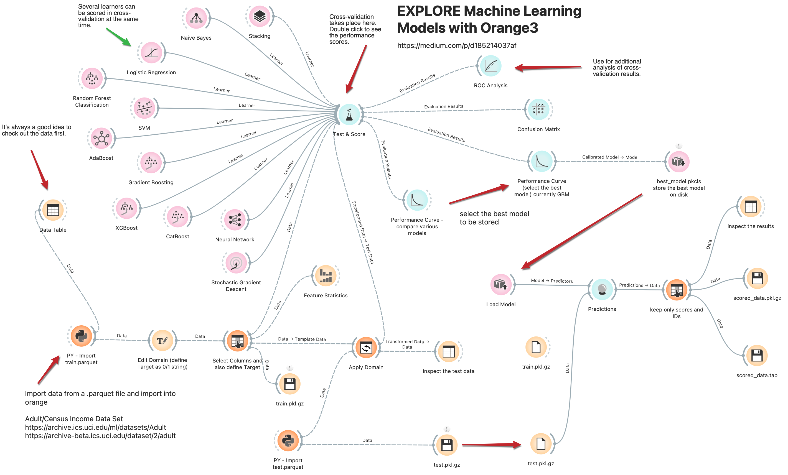

# Orange3 -  Machine Learning comparing different algorithms, low-code

for details check out the Medium article:

https://medium.com/p/d185214037af

KNIME and Python — Setting up and managing Conda environments (https://medium.com/p/2ac217792539)

# 
conda create --name py_orange python=3.9

conda activate py_orange

conda install pip

conda config --add channels conda-forge

conda update -n py_orange --all

conda install -n py_orange -c conda-forge xgboost

#

